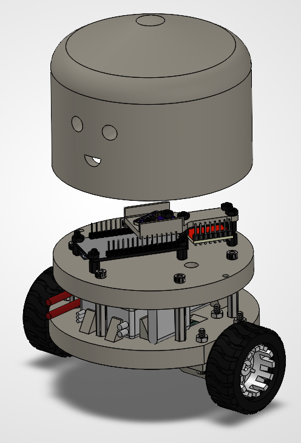
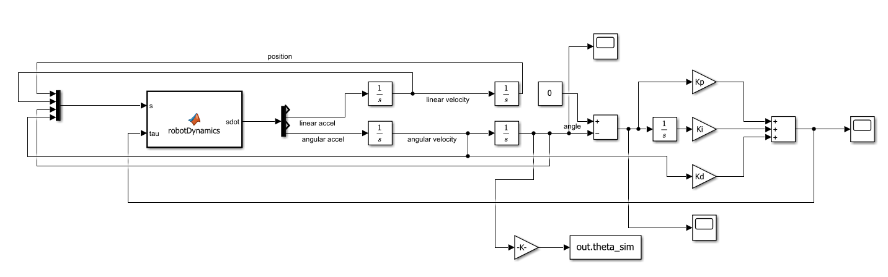

# Self-Balancing Bot

## Situation
I wanted a project that would be genuinely hard, because an easy project teaches you nothing you did not already know. A self balancing robot was the right choice specifically because of how many separate things it demands at once. It needs control theory, math beyond what I had formally learned, and physical skills like soldering, CAD, and 3D printing. Nothing about it could be finished by being good at one thing.

## Task
The baseline goal was simple to state and hard to reach, which was to make the robot balance on its own. Driving it under command was something I wanted eventually, but I deliberately kept it out of scope for this version so that balancing got my full attention.

## Action
I started with the theory rather than the parts. Before ordering anything I learned how PID control works, because the component choices only make sense once you understand what the controller needs from them.

For the microcontroller I chose an ESP32, for its processing speed and its small size relative to what it offers. For the motors I chose N20 gearmotors with a 1 to 100 gearbox reduction. A balancing robot does not need speed, it needs the torque to shove the wheels hard enough to catch itself as it tips, and a high reduction ratio trades the first for the second. I also chose motors with encoders even though encoders are not needed to balance, and I knew that when I picked them. Driving the robot is the next thing I want to build, and adding drive functionality later would require them. Choosing a part for a feature that does not exist yet cost nothing at the time and saves rebuilding the drivetrain later.

I tested every component on a breadboard before committing to a physical design, including running the complementary filter against the real motors to confirm the sensing and the actuation worked together. Finding a problem on a breadboard is a rewire, while finding the same problem after assembly is a teardown.

### Building the robot
I modeled the chassis in CAD and built it from 3D printed disc plates connected by metal hex standoffs, with bolts and nuts fastening everything together. The standoffs are there for stiffness. A frame that flexes lets the whole robot vibrate, and since the IMU is mounted to that frame, it reads those vibrations as real tilt and the controller reacts to motion that is not actually happening.

This version is wired with Dupont cables, which made prototyping fast and changes easy. Building it also meant learning to solder and crimp wires, neither of which I had done before. My one wiring mistake was assigning components to pins the ESP32 reserves for UART, which was quickly found and moved, and it taught me that not every pin on a development board is free to use. The wiring overall is the part of this build I am least satisfied with, and making a custom PCB to house the components properly is on my list for the next iteration.

### Modeling before tuning
Rather than guessing at controller values, I built a model of the robot in MATLAB. I drew free body diagrams, derived the equations of motion from them, and set the problem up so MATLAB could solve those equations and predict how the robot would move. I then designed the PID controller in Simulink against that model.

The point of this was to start tuning from an analytical baseline rather than from arbitrary numbers. Tuning a PID controller by pure trial and error on real hardware means a physical robot falling over repeatedly while you search blindly, and having a modeled starting point meant the first values I tried on the real robot were already in a sensible range.

The model was not an accurate picture of the real robot, and the gains it produced were a good ballpark rather than final values. Two things I left out account for most of that gap. The first is backlash in the gearboxes, since gear teeth have clearance between them and a motor reversing direction turns a little before that clearance closes and the wheel actually responds. That matters more here than in most applications, because a balancing robot reverses direction constantly and pays the cost on every single correction. The second is the motors themselves, which I modeled as if they produced torque instantly rather than as electrical systems that take time to respond. Modeling the electrical side, meaning armature resistance, inductance, and back EMF, is something I want to learn how to do for the next version.

### Estimating the angle
My first approach to measuring tilt was to use the gyroscope alone and integrate its readings to track the angle. That did not hold up. A gyroscope measures rotation rate rather than position, so getting an angle out of it means adding up rate readings over time, and every small error in those readings gets added in permanently. The estimate slowly drifts away from the truth, and a controller balancing against a drifting angle will eventually be balancing against a number that has nothing to do with reality.

The fix was a complementary filter, which blends the gyroscope with the accelerometer. The gyroscope is trusted for short term changes, where it is accurate, and the accelerometer is trusted for the long term reference, since it can sense which way gravity points and never drifts. Working out why my first approach failed is how I actually learned what sensor fusion is for, rather than just using it because a tutorial said to.

### Tuning
I built a web interface, served from the ESP32 itself, that exposes the PID gains for live adjustment. This came out of frustration rather than planning. Reflashing the microcontroller for every value change made tuning painfully slow, and PID tuning needs many iterations. Being able to change a gain and watch the robot's response immediately turned tuning from a chore into something I could actually iterate on.

## Result
The robot balances. On level ground it holds itself upright for an extended stretch, which was the goal I set at the start.

It does not balance forever. Over time it gradually wanders from where it started, and eventually that wandering ends in a fall. This is not mysterious, and it follows directly from what I built. The controller has one loop, and that loop only cares about the tilt angle. Nothing in the system is watching where the robot actually is, so it has no reason to hold position, and small drifts accumulate with nothing to correct them.

The fix is a tighter control loop and bringing the encoders into the system, which would let the robot track its position and correct the wandering rather than just the tipping. Those encoders have been sitting on the motors since the first parts order for exactly this reason. Adding drive functionality and building a custom PCB are the other two things I plan to do to it.

What I set out to get from this project was a difficult problem that would force me to learn several new skills at once, and that is what it delivered. I learned control theory by needing it, learned sensor fusion by watching my first approach fail, and picked up soldering, crimping, CAD, and 3D printing along the way.

