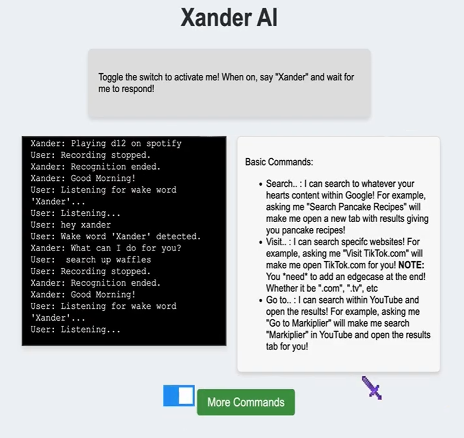
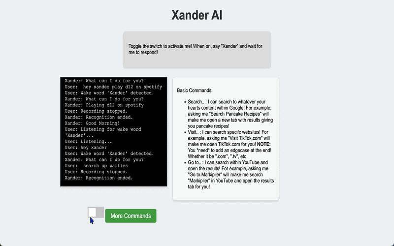

# Xander, a Voice-Controlled AI Assistant

## Situation
I took an AI course through Code2College where we studied machine learning and large language models, working toward a final project of designing and building an AI application of our own. Students were grouped into teams and asked to identify a real problem that AI could solve, then build the solution end to end.

## Task
My team needed to choose a problem worth solving and ship a working product. We landed on multitasking. Whether we were doing schoolwork or personal projects, constantly switching between the task itself and the computer actions supporting it, things like searching, opening tabs, and launching programs, kept breaking our focus. An assistant that could take those actions on command would give us an extra pair of hands. We also recognized that voice control carried an accessibility benefit beyond our own use case, since it makes a computer easier to operate for people with limited hand mobility or for anyone less comfortable navigating software.

My individual responsibility was the entire front end, meaning the interface users would see and speak to, along with supporting my teammates on backend integration, building the presentation we used to demo the project, and running our weekly team meetings.

## Action
We designed Xander around a wake word. The program listens continuously through the microphone using PyAudio, and when it hears "Xander" followed by a command, it transcribes the speech and executes the matching action on the user's computer. We also integrated the GPT-3 model so users could ask open ended questions instead of being limited to a fixed command list. A Flask backend connected the browser based interface to the Python code that carried out the actual computer actions.

I built the front end in HTML, CSS, and JavaScript. That included the main landing page, a help section documenting the available commands, and the interactive UI for the assistant itself. The UI had the microphone input control and visual feedback states, so a user could tell whether Xander was idle, listening, or working. That feedback matters more in a voice interface than in a normal application, because there is otherwise no way to know the program heard you.

Outside my own scope, I collaborated with my teammates on the backend and its Flask integration whenever they needed help, which meant I had to understand how their code used what my interface sent. We used GitHub for version control so front end and backend work could move in parallel and merge cleanly, and I helped guide our weekly meetings to share progress, surface blockers, and keep the team on schedule.

## Result
The speech recognition worked reliably as long as the noise level in the room was kept low. Xander supported a set of commands we chose because we found them useful, mostly searching and looking things up, opening applications, and a few application specific actions like pulling up a YouTube video or playing a song on Spotify. Our plan was to let users add their own custom commands when ours did not cover what they needed, but we never reached that goal before the project ended.

Using Xander did make my own workflow more efficient. When I got stuck on a math problem, instead of stopping to open a browser, search, and read through results, I could ask Xander to pull up a video explaining the concept and keep working while it loaded.

The biggest thing I took away was learning how to work inside code I had not written myself. Supporting the backend meant understanding how my teammates had structured their work before I could add to it, which made clear communication more valuable than writing code quickly. We did not hit every goal we set, but we shipped a working AI.

