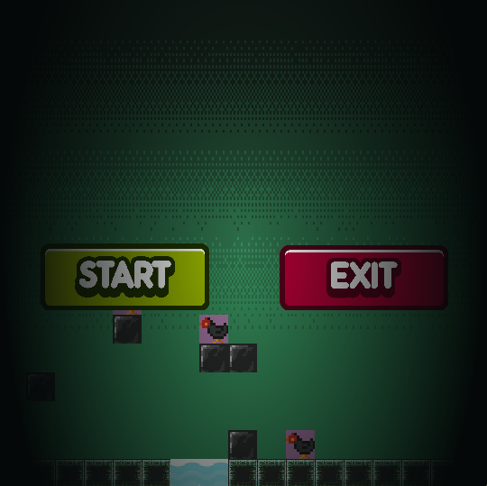
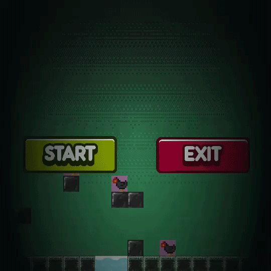

# Dungeon Cat

## Situation
In my game development class we learned to use Pygame, and the goal was to build a complete game of our own with it. Pygame gives you the pieces for drawing to a screen, reading input, and playing sound, but it is not a game engine with a level editor or a physics system built in. Everything past those basics, including the levels, the collisions, and the rules, had to be written by hand.

## Task
I decided to build a 2D platformer. Before writing code I worked out the premise and the win condition, because in a platformer those two things determine the level design. The player is a cat who chased the farmer's chickens out of their coop, and the punishment is being sent into a dungeon to find them. To finish a level the player has to collect all of the chickens hidden in it and reach the way out.

## Action
I built the game in Python using Pygame. I initialized Pygame as the engine and structured the game around a while loop that holds the game logic, which is the standard shape of a game program. Each pass of that loop reads input, updates the state of everything on screen, and redraws the frame. Understanding that a game is a loop running many times per second, rather than a program that runs once from top to bottom, was the shift I had to make coming from the programs I had written before.

I used functions and classes throughout, applying object oriented programming so that things like the player and the hazards each carried their own data and behavior instead of being tracked through loose variables. That mattered as the game grew, since adding a new enemy meant creating another object rather than threading more variables through the rest of the code. I kept the level code in its own file, separate from the main game file, so level content and game logic did not tangle together.

Player movement runs on both the WAD keys and the arrow keys, so the controls match whichever convention a player already expects.

I imported the image and sound assets the game uses and wired them into the levels. Each level puts enemies, lava, and obstacles between the player and the chickens, so the difficulty comes from routing through the hazards rather than from the collecting itself.

The mechanic I am most satisfied with is the lighting. The caves are dark and the cat carries a torch, so the player can only see a small area around themselves. That single constraint changes how the whole game plays, because a hazard the player cannot see yet has to be learned by exploring carefully rather than by reading the layout at a glance.

## Result
The finished game works, with multiple playable levels, collectible chickens, and hazards throughout. The source is on GitHub at [alysonhernandez/DungeonCat](https://github.com/alysonhernandez/DungeonCat).

This project was where Pygame went from something I had seen demonstrated to something I could build with. The specific thing I took away was working with assets, since importing images and sounds and getting them to behave correctly inside the game loop was a different problem from writing the logic, and it is the part that makes a game feel like a game rather than a program.

