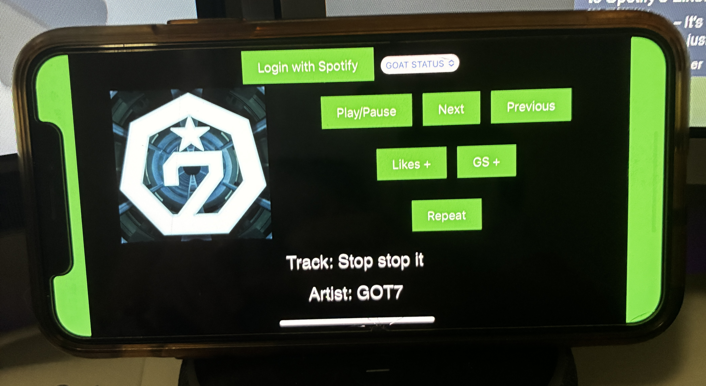

# Spotify Player Revamp

## Situation
Whenever I was gaming or working on my computer, changing what was playing meant tabbing out of what I was doing, finding the Spotify window, and tabbing back. It was a small interruption, but a constant one, and it broke focus every time. The official Spotify client also gives every user the same interface, most of which I never touch, while the few actions I do use repeatedly are buried behind other controls.

## Task
I wanted a Spotify controller I could run on an old iPhone sitting next to my keyboard, so changing tracks never touched the computer I was actually using. Since I was building it only for myself, I could design it around my own playlists and the specific actions I use most rather than around what a general audience would need.

## Action
I built the app in JavaScript, HTML, and CSS, and structured it as a Progressive Web App. That was the decision that made the whole idea work. A manifest file and a service worker let the page install to the iPhone home screen and open like a normal app, without a browser address bar and without going through an app store, which matters because Apple would never have let a personal Spotify client into one.

For authentication I used the OAuth authorization code flow with PKCE. The app generates a random code verifier, hashes it with SHA-256, sends the hash to Spotify when it asks for authorization, and then proves it holds the original verifier when it exchanges the code for a token. That extra step exists because an app running entirely in a browser cannot hide a client secret, so PKCE replaces the secret with something the app proves it knew all along. The app requests only the scopes it needs rather than blanket access to the account.

The controller talks to the Spotify Web API over its player endpoints instead of embedding a playback SDK. That distinction is what makes the setup useful. The phone does not play the music itself. It sends commands to whatever device is already active, so audio keeps coming out of my computer while the phone acts purely as a remote, which is exactly the behavior I wanted.

The interface holds only what I actually use. A dropdown selects between my own playlists, play, pause, next, previous, and repeat handle transport, and the current track shows with its album art and artist. The two controls I built specifically for myself are quick add buttons, one that saves the current track to my Liked Songs and one that drops it straight into my main playlist, so a song I like while gaming gets saved without ever leaving the game. The app polls for track information so the display stays current as songs change.

The app is hosted on GitHub Pages, which gives it the HTTPS address that both the service worker and the Spotify OAuth redirect require.

## Result
The setup does what I built it for. My phone is now a dedicated Spotify remote, and I no longer tab out of a game or my work to change what is playing. Building it for one user turned out to be the advantage rather than a limitation, because every control on the screen is one I use, and the two quick add buttons are actions the official client makes slower than they need to be.

There are two things I want to improve. The interface is functional but plain, and cleaning up the visual design is the next thing I will do to it. I also want to add support for Spotify DJ, which the app currently cannot reach.

This project taught me how OAuth actually works rather than how to copy an auth snippet, and it was my first time building something installable rather than a page someone visits.